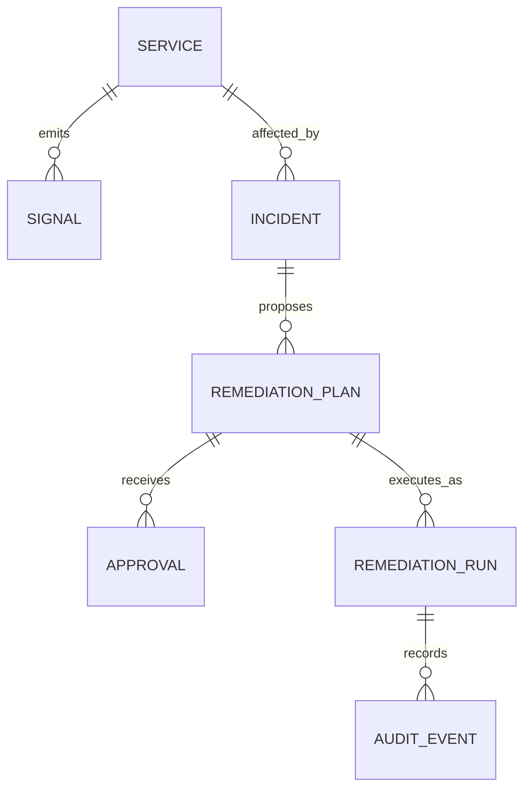

# APIs for Aegis: Must-Know Guide

> A practical guide to designing, building, documenting, testing, and operating APIs for **Aegis — Observability & Controlled Remediation Platform**.

## How to use this guide

Do not try to memorize everything in one sitting.

1. Read **Must know before building**.
2. Build the endpoints in **Aegis API plan** in order.
3. Use the checklists while reviewing each endpoint.
4. Return to **Good to know next** when the first vertical slice works.

The objective is not merely to expose HTTP endpoints. Aegis APIs must make incidents, approvals, and remediation actions **safe, observable, and easy to reason about**.

---

## 1. What an API is

An **Application Programming Interface (API)** is a contract through which one program requests work or data from another program.

For a web API, the contract includes:

- **URL** — where to send the request
- **HTTP method** — what operation is requested
- **headers** — metadata such as authentication and content type
- **request body** — input data, usually JSON
- **status code** — outcome category
- **response body** — returned JSON data or error details

Example:

```http
POST /v1/incidents
Content-Type: application/json

{
  "service_id": "svc_checkout",
  "title": "Error rate exceeded threshold",
  "severity": "high",
  "source": "prometheus"
}
```

The API should respond predictably:

```http
201 Created
Content-Type: application/json

{
  "id": "inc_01J...",
  "status": "open",
  "service_id": "svc_checkout",
  "severity": "high",
  "created_at": "2026-09-19T12:00:00Z"
}
```

**Key idea:** An API is a promise. Clients should not need to read your source code to know how to use it.

---

## 2. Must know before building

### HTTP request anatomy

```text
METHOD /path?query=value HTTP/1.1
Host: api.aegis.local
Authorization: Bearer <token>
Content-Type: application/json
Idempotency-Key: 7c16...

{ "JSON": "body" }
```

| Part | Purpose | Aegis example |
| --- | --- | --- |
| Method | Intent of the request | `POST` creates an incident |
| Path | Resource being addressed | `/v1/incidents/inc_123` |
| Query parameters | Filtering, pagination, optional behaviour | `?status=open&limit=20` |
| Headers | Auth, tracing, content negotiation | `Authorization`, `X-Request-ID` |
| Body | Input payload | Create an approval request |
| Status code | Standard outcome signal | `201`, `404`, `409` |
| Response body | Result or structured error | Incident JSON |

### HTTP methods

| Method | Meaning | Safe? | Idempotent? | Aegis use |
| --- | --- | ---: | ---: | --- |
| `GET` | Read data | Yes | Yes | Get an incident |
| `POST` | Create or trigger an action | No | Usually no | Create incident, approve remediation |
| `PUT` | Replace full resource | No | Yes | Replace a service configuration |
| `PATCH` | Partially update resource | No | Depends | Update incident metadata |
| `DELETE` | Remove resource | No | Usually yes | Remove a test service |

**Idempotent** means sending the same request multiple times produces the same final state. It matters when networks retry requests.

### JSON fundamentals

Use JSON for external API payloads:

```json
{
  "service_id": "svc_demo_api",
  "labels": {
    "environment": "demo",
    "team": "platform"
  },
  "enabled": true
}
```

Rules:

- Use `snake_case` consistently in Python-facing APIs.
- Use ISO 8601 UTC timestamps: `2026-09-19T12:00:00Z`.
- Use strings for IDs, not database integer IDs exposed as implementation details.
- Use explicit enums for finite state: `"open"`, `"acknowledged"`, `"resolved"`.
- Do not silently accept unknown or malformed fields.

---

## 3. REST and resource design

REST is not a library. It is a style of mapping API URLs to **resources**.

A resource is a meaningful entity in your domain:

- service
- signal
- incident
- remediation plan
- approval
- remediation run
- audit event

Prefer nouns in URLs:

```text
GET  /v1/incidents
GET  /v1/incidents/{incident_id}
POST /v1/incidents
```

Avoid RPC-like URLs when a resource model is clearer:

```text
Avoid: POST /restartContainer
Better: POST /v1/remediation-runs
```

Actions are sometimes valid, especially for state transitions. Make their target and result explicit:

```text
POST /v1/remediation-plans/{plan_id}/approvals
POST /v1/remediation-runs/{run_id}/cancel
```

### Aegis domain model



### Use plural collection names

```text
/v1/services
/v1/incidents
/v1/remediation-plans
/v1/remediation-runs
/v1/audit-events
```

---

## 4. Aegis API plan: build this in order

### Step 1 — Service registry

A service is something Aegis can observe. Start here.

```text
POST   /v1/services
GET    /v1/services
GET    /v1/services/{service_id}
PATCH  /v1/services/{service_id}
DELETE /v1/services/{service_id}
```

Create request:

```json
{
  "name": "demo-api",
  "environment": "demo",
  "health_url": "http://demo-api:8000/health",
  "labels": {
    "owner": "platform",
    "tier": "backend"
  }
}
```

### Step 2 — Signals and incidents

A **signal** is evidence: an alert, log anomaly, failed health check, or metric threshold breach.

An **incident** is the operator-facing event created after Aegis evaluates that evidence.

```text
POST /v1/signals
GET  /v1/incidents
GET  /v1/incidents/{incident_id}
PATCH /v1/incidents/{incident_id}
```

Keep raw signals separate from incidents. Multiple signals may belong to one incident.

### Step 3 — Remediation plans

A plan is a proposed, safe action—not the action itself.

```text
POST /v1/incidents/{incident_id}/remediation-plans
GET  /v1/remediation-plans/{plan_id}
```

Example plan:

```json
{
  "incident_id": "inc_123",
  "action_type": "restart_compose_service",
  "target": {
    "service": "demo-api"
  },
  "reason": "The service has remained unhealthy for 5 minutes.",
  "risk_level": "low",
  "status": "pending_approval"
}
```

### Step 4 — Approval

The approval endpoint is a critical safety boundary.

```text
POST /v1/remediation-plans/{plan_id}/approvals
```

```json
{
  "decision": "approved",
  "comment": "Approved for demo environment only."
}
```

The server must check:

- Is the caller authorized?
- Is the plan still pending approval?
- Is the action allow-listed?
- Does the environment permit this action?
- Has another user already decided?

### Step 5 — Remediation runs

An approved plan creates a run. This should usually be asynchronous.

```text
POST /v1/remediation-plans/{plan_id}/runs
GET  /v1/remediation-runs/{run_id}
```

Return `202 Accepted` when a worker has accepted work but has not completed it.

```json
{
  "id": "run_456",
  "plan_id": "plan_123",
  "status": "queued",
  "accepted_at": "2026-09-19T12:00:00Z"
}
```

### Step 6 — Audit trail

Never treat audit logs as normal application logs. They must answer:

- what happened?
- who requested or approved it?
- what was the target?
- when did it happen?
- what was the outcome?
- what evidence supported the decision?

```text
GET /v1/audit-events?incident_id=inc_123
```

---

## 5. Status codes you must use correctly

| Code | Meaning | Aegis example |
| --- | --- | --- |
| `200 OK` | Read/update succeeded | Incident returned |
| `201 Created` | New resource created | Signal or service created |
| `202 Accepted` | Accepted for async processing | Remediation run queued |
| `204 No Content` | Successful request with no body | Test service deleted |
| `400 Bad Request` | Invalid request shape/semantics | Invalid filter value |
| `401 Unauthorized` | Missing/invalid identity | Token absent or invalid |
| `403 Forbidden` | Identity exists but lacks permission | Viewer tries to approve a plan |
| `404 Not Found` | Resource does not exist | Unknown incident ID |
| `409 Conflict` | Valid request conflicts with current state | Plan already approved |
| `422 Unprocessable Content` | Structured validation fails | Invalid severity enum |
| `429 Too Many Requests` | Rate limit exceeded | Signal ingestion flood |
| `500 Internal Server Error` | Unexpected server failure | Bug or unavailable dependency |
| `503 Service Unavailable` | Temporary dependency/service outage | Database unavailable |

Do not return `200` for every situation. Proper status codes help clients recover correctly.

---

## 6. Validation and error responses

Validate at the API boundary. In FastAPI, define Pydantic request and response models.

Bad:

```python
@app.post("/incidents")
def create_incident(payload: dict):
    ...
```

Better:

```python
class CreateIncidentRequest(BaseModel):
    service_id: str
    title: str = Field(min_length=1, max_length=200)
    severity: Literal["low", "medium", "high", "critical"]
    source: Literal["prometheus", "loki", "health_check"]
```

Use one consistent error shape for domain errors:

```json
{
  "error": {
    "code": "INVALID_STATE_TRANSITION",
    "message": "Only pending_approval plans can be approved.",
    "request_id": "req_abc123",
    "details": {
      "current_status": "executed"
    }
  }
}
```

Good error messages are safe, specific, and actionable. Never leak stack traces, secrets, internal hostnames, or SQL.

---

## 7. State machines: essential for Aegis

Aegis is workflow-heavy. Write state transitions explicitly before coding.

### Incident states

```text
open → acknowledged → investigating → resolved
                     ↘ suppressed
```

### Remediation-plan states

```text
draft → pending_approval → approved → executing → completed
                       ↘ rejected       ↘ failed
                       ↘ expired
```

Validate transitions in the service layer, not only in the UI.

Example: an `approved` plan cannot be approved a second time. Return `409 Conflict`, not a silent success.

---

## 8. Authentication, authorization, and RBAC

Authentication answers **who are you?**

Authorization answers **may you do this?**

Start with roles:

| Role | Can view | Can create plans | Can approve | Can execute |
| --- | ---: | ---: | ---: | ---: |
| Viewer | Yes | No | No | No |
| Operator | Yes | Yes | No | No |
| Approver | Yes | Yes | Yes | No |
| Admin | Yes | Yes | Yes | Yes |

For a local first version, use a development identity or simple JWT. Do not confuse that with production security.

Later considerations:

- short-lived access tokens
- refresh token rotation
- service-to-service authentication
- API keys for ingestion sources
- scoped permissions
- approval separation of duties
- secret storage and rotation

**Aegis-specific rule:** The identity that detects an incident must not automatically be treated as authorized to execute remediation.

---

## 9. Sync vs async API work

Use synchronous endpoints when work is short and predictable:

- read a service
- create an incident record
- validate an approval

Use asynchronous jobs when work may take time, fail, retry, or call external systems:

- verify recovery
- process batches of signals
- execute a remediation
- run anomaly detection
- query long windows of logs/metrics

Typical async pattern:

1. Client sends `POST /runs`.
2. API validates input and persists a run with `queued` status.
3. API puts work on a queue.
4. API returns `202 Accepted` and a run URL.
5. Worker performs the task.
6. Client polls `GET /runs/{id}` or receives an event.

This avoids holding HTTP connections open and makes retries easier.

---

## 10. Idempotency, retries, and concurrency

Distributed systems retry. Design for that from the start.

### Idempotency keys

For state-changing requests that might be retried, accept:

```text
Idempotency-Key: 48fd...
```

Store the key with the result. If the client sends the same key again, return the original result instead of creating a duplicate remediation run.

Use this for:

- creating a remediation run
- ingesting externally retried alerts
- recording approvals

### Optimistic concurrency

A user may approve a plan while another rejects it. Prevent lost updates with a version number:

```json
{
  "id": "plan_123",
  "version": 3,
  "status": "pending_approval"
}
```

The client submits the expected version. If the record changed, return `409 Conflict`.

### Retries

Retries need:

- maximum attempt count
- exponential backoff
- idempotent worker actions
- clear failure reason
- dead-letter or manual-review path

Never blindly retry a destructive action.

---

## 11. Pagination, filtering, and sorting

List endpoints must not return every record forever.

```text
GET /v1/incidents?status=open&severity=high&limit=20&cursor=...
```

Start with `limit` and `offset` for learning. Move to cursor pagination when data grows or records are continuously inserted.

Guidelines:

- Set a default and maximum `limit`.
- Allow only known filter fields.
- Document default sorting.
- Use stable ordering, usually `created_at DESC, id DESC`.
- Never pass raw SQL filters from a query parameter.

---

## 12. Versioning and compatibility

Prefix routes with a version from day one:

```text
/v1/incidents
```

You do not need `v2` until you make a breaking change. Examples of breaking changes:

- rename/remove a response field
- change a field type
- alter endpoint meaning
- change authentication requirements unexpectedly

Prefer additive changes first:

- add optional response field
- add optional query parameter
- add new endpoint

---

## 13. Observability for your API

Aegis must observe itself.

Every request should produce:

- **structured log** — request method, route, status, duration, request ID
- **metric** — request count, error count, latency histogram
- **trace** — request path through API, database, worker, and outbound calls

Useful metrics:

```text
http_server_requests_total
http_server_request_duration_seconds
aegis_incidents_created_total
aegis_remediation_runs_total
aegis_remediation_run_duration_seconds
aegis_remediation_failures_total
```

Useful fields in logs:

```json
{
  "event": "remediation_run_completed",
  "request_id": "req_123",
  "incident_id": "inc_123",
  "plan_id": "plan_123",
  "run_id": "run_123",
  "status": "completed",
  "duration_ms": 842
}
```

Use a request/correlation ID across API, worker, logs, traces, and audit records.

---

## 14. API documentation

FastAPI automatically creates OpenAPI documentation. Treat it as a starting point, not the complete documentation.

Maintain:

- route summary and description
- request/response examples
- status-code documentation
- authentication requirements
- error contract
- architecture and workflow documents
- curl examples for the happy path and failure path

Minimum curl examples:

```bash
curl -X POST http://localhost:8000/v1/services \
  -H "Content-Type: application/json" \
  -d '{"name":"demo-api","environment":"demo","health_url":"http://demo-api:8000/health"}'
```

```bash
curl "http://localhost:8000/v1/incidents?status=open&limit=20"
```

A recruiter should be able to clone the repository, start the stack, open `/docs`, and understand the core workflow.

---

## 15. API testing

Test three layers.

### Unit tests

Test pure business rules:

- valid and invalid state transitions
- severity mapping
- remediation allow-list checks
- permission decisions

### Integration tests

Test API + database + worker boundaries:

- creating an incident persists correctly
- duplicate idempotency key does not create two runs
- unauthorized approval returns `403`
- rejected plan cannot create a run

### End-to-end tests

Test the actual demonstration:

1. create service
2. induce latency
3. receive signal
4. create incident
5. create and approve plan
6. run remediation
7. verify recovery
8. query audit events

Tools to know:

- `pytest`
- FastAPI `TestClient` or `httpx`
- test database/container
- `curl` for manual smoke tests
- k6 for load and failure simulations

---

## 16. Security rules for Aegis

- Treat every request body, header, query parameter, and webhook as untrusted.
- Validate all input.
- Use parameterized database queries through an ORM or safe query library.
- Keep secrets in environment variables or a secret manager; never commit them.
- Redact authorization headers, tokens, and passwords from logs.
- Use allow-listed remediation actions and targets.
- Separate approval from execution.
- Record security-relevant events in audit logs.
- Apply rate limits to signal-ingestion endpoints.
- Restrict CORS to known front-end origins when a browser UI exists.

**Never build:** `POST /run-command` with arbitrary shell input.

---

## 17. Good to know next

These are valuable after the first end-to-end flow works:

- Webhooks for Prometheus Alertmanager ingestion
- Server-Sent Events or WebSockets for live incident updates
- OpenAPI client generation
- Contract testing between API and frontend
- Circuit breakers for unreliable external dependencies
- Outbox pattern for reliable event publication
- Dead-letter queues
- Event-driven architecture and message schemas
- Distributed tracing context propagation
- SLOs, error budgets, and alert fatigue
- Terraform and CI/CD deployment
- Kubernetes controllers/operators

Do not add them merely because they sound advanced. Add each only when it solves a real limitation you can explain.

---

## 18. Endpoint review checklist

Before merging a new endpoint, ask:

- [ ] Is the URL a clear resource or state transition?
- [ ] Is the HTTP method correct?
- [ ] Are request and response models typed?
- [ ] Are validation errors clear?
- [ ] Are success and failure status codes correct?
- [ ] Is authentication and authorization explicit?
- [ ] Is a duplicate/retry safe?
- [ ] Is a long-running action asynchronous?
- [ ] Is the action observable in logs, metrics, and traces?
- [ ] Is it covered by at least one meaningful test?
- [ ] Is it documented in OpenAPI and README/docs?
- [ ] Does it preserve Aegis safety boundaries?

---

## 19. Recommended first implementation order

1. `GET /health` for the Aegis API itself.
2. `POST /v1/services` and `GET /v1/services`.
3. `POST /v1/signals`.
4. `POST /v1/incidents` and `GET /v1/incidents/{id}`.
5. Prometheus metrics and structured logs for those routes.
6. `POST /v1/incidents/{id}/remediation-plans`.
7. `POST /v1/remediation-plans/{id}/approvals`.
8. `POST /v1/remediation-plans/{id}/runs` returning `202`.
9. Worker-backed restart of the **demo** service only.
10. Audit event endpoint and recovery verification.

At each step, write a short entry in `Docs/incidents/` or `Docs/learnings/`: what you built, what failed, and what design decision you made.

---

## Final mental model

An API is not a collection of routes.

For Aegis, it is a **safe operational contract**:

```text
Evidence enters → state is created → humans make accountable decisions → constrained actions run → outcomes are observable and auditable.
```

If every endpoint respects that model, the project will teach you backend design, reliability engineering, security boundaries, asynchronous systems, and production documentation at the same time.
